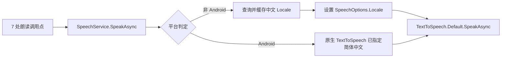

## 产品概述

Windows 端朗读完全无声，需要修复。该问题是"朗读设置（角色/语速/音量）"功能上线后暴露的，影响范围是所有页面的朗读。

## 核心功能

- **修复 Windows 无声**：让 Windows 端朗读显式选用系统已安装的中文语音，而不是依赖系统默认语音
- **语音状态可见**：在朗读设置弹窗中显示当前生效的语音，便于用户自查
- **缺语音包时给出指引**：若 Windows 未安装中文语音包，明确提示用户去系统设置中安装，而不是静默失败

## 边界说明

- 仅修复 Windows / 非 Android 平台的语音选择逻辑，不改动 Android 原生实现（其已通过原生 API 指定简体中文）
- 不改动角色、语速、音量的既有交互与持久化方式
- 不改动任何页面的朗读调用点（7 处保持不变，由统一服务内部修复）

## 技术栈

- 框架：.NET MAUI 9（`Microsoft.Maui.Essentials` 9.0.111，SDK 9.0.312），C# + XAML
- 朗读：MAUI `TextToSpeech`（Windows 端底层为 `Windows.Media.SpeechSynthesis.SpeechSynthesizer`）
- 无需新增 NuGet 包

## 实现方案

### 总体策略

统一在朗读服务内部解决：非 Android 平台在朗读前查询系统可用语音，选中中文语音并通过 `SpeechOptions.Locale` 显式指定，再调用 `TextToSpeech.Default.SpeakAsync`。这样 7 处调用点无需任何改动即可全部受益。

### 关键决策

**为什么根因是缺 Locale 而不是音量**
用户已确认三项事实：没有错误弹窗（说明调用未抛异常）、设置里音量显示 100%（说明 `Settings.Volume = 1.0` 正常）、所有页面都无声（说明是服务层全局问题，而非某个页面）。三者组合指向"TTS 调用成功返回但没有音频输出"。Windows 上若未指定 `Locale`，合成器使用系统默认语音；默认语音不支持中文时不会报错，而是静默无输出——这与现象完全吻合。

**为什么要缓存查询结果**
`GetLocalesAsync()` 涉及系统 API 调用，而连读场景（如拼音表连读 63 项、古诗逐行）会在短时间内高频调用 `SpeakAsync`。缓存解析结果可避免每条都重复查询，属于必要的性能保护。

**为什么查询失败不能阻断朗读**
若 `GetLocalesAsync()` 抛异常或返回空，应当记录日志并回退到不指定 `Locale` 的现状行为，保证"至少不比现在更差"，而不是让朗读彻底失效。

### 实现注意事项

- `SpeechOptions.Locale` 属于 `Microsoft.Maui.Media`，项目已启用 MAUI 隐式 using，可直接引用
- 语速设置（`Settings.Rate`）在非 Android 平台依旧无法真正生效（MAUI 9 无此能力），本次不处理，保持现状
- Android 侧必须同步实现新增的接口方法，否则 Android TFM 编译会报"未实现接口成员"
- 改动集中在服务层，对 UI 的改动仅为设置弹窗增加一行状态文本，风险可控

## 架构设计

改动全部落在既有分层内，数据流保持不变，仅在"调用系统 TTS 前"插入一步语音选择：



## 目录结构

```
EnglishReadingApp/
├── Services/
│   ├── ISpeechService.cs                  # [MODIFY] 新增 GetVoiceStatusAsync 方法声明，供设置页展示语音状态
│   └── SpeechService.cs                   # [MODIFY] 非 Android 实现：新增中文语音解析与缓存、
│                                          #            SpeakAsync 设置 Locale、实现 GetVoiceStatusAsync
├── Platforms/
│   └── Android/
│       └── SpeechService.android.cs       # [MODIFY] 实现 GetVoiceStatusAsync（返回当前选中音色），
│                                          #            保持原生 TTS 逻辑不变（同步实现接口以免编译失败）
└── Chinese/
    ├── ChinesePoetryPage.xaml             # [MODIFY] 设置弹窗增加一行"语音状态"提示文本
    └── ChinesePoetryPage.xaml.cs          # [MODIFY] 打开设置时异步加载并展示语音状态
```

## 关键代码结构

非 Android 实现的核心形态（要点：缓存 + 失败回退 + 不阻断朗读）：

```
// 缓存：避免连读场景每次都查询系统语音列表
private Locale? _resolvedLocale;
private bool _localeResolved;

private async Task<Locale?> ResolveChineseLocaleAsync()
{
    if (_localeResolved) return _resolvedLocale;
    try
    {
        var locales = await TextToSpeech.Default.GetLocalesAsync();
        _resolvedLocale =
            locales?.FirstOrDefault(l => l.Language?.Equals("zh-CN", StringComparison.OrdinalIgnoreCase) == true)
            ?? locales?.FirstOrDefault(l => l.Language?.StartsWith("zh", StringComparison.OrdinalIgnoreCase) == true);
    }
    catch (Exception ex)
    {
        Debug.WriteLine($"查询可用语音失败: {ex.Message}");
        _resolvedLocale = null;   // 失败时回退现状行为，不阻断朗读
    }
    _localeResolved = true;
    return _resolvedLocale;
}
```

`SpeakAsync` 中在调用前补一句：若解析到中文语音则 `options.Locale = zh;`

## Agent Extensions

### MCP

- **codebase-memory-mcp**
- 用途：改动前用 `search_code` 复查全部 `SpeechService.Current.SpeakAsync` 调用点，确认 7 处调用无遗漏；改动后用 `detect_changes` 核对影响面，确认未波及无关模块
- 预期结果：得到完整调用点清单与影响范围，确保修复覆盖全部朗读入口

### SubAgent

- **codebase-memory-scout**
- 用途：复核是否还有其它直接使用 `TextToSpeech.Default` 或自行构造 `SpeechOptions` 的地方未走统一服务（避免修复遗漏死角）
- 预期结果：确认全部朗读路径均收敛到 `SpeechService`，无旁路