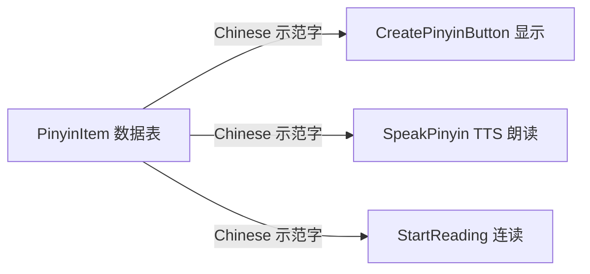

## 产品概述

汉语拼音字母表页（ChinesePinyinAlphabetPage）点击拼音后由 TTS 朗读其对应的汉字示范字。本次对该页 63 个拼音的示范字做读音校验，修正明确读错的字，并把易被 TTS 按多音字误读的字替换为单音同音字，确保发音准确。

## 核心功能

- **修正读音错误**：声母 `c` 与整体认读音节 `ci` 的示范字由四声字改为标准一声字，使读音符合标准呼读音
- **规避多音字误读**：把存在多个读音、会被 TTS 按自身词库选错音的示范字，替换为读音唯一的同音字
- **保留无法规避的字并记录**：汉语中无单音同音字可替换的多音字保持原样，在代码中注明风险，便于日后处理

## 边界说明

- 仅修改示范字（`Chinese` 字段）的取值，不改动 `Pinyin`、`Example` 字段
- 不改动任何 UI 布局、按钮样式与朗读逻辑（点击朗读、连读、高亮均保持原样）
- 不启用 `Example` 例词、不改动连读交互体验

## 技术栈

- 框架：.NET MAUI（Microsoft.Maui.Controls），C# + XAML
- 语音朗读：MAUI 内置 `TextToSpeech`（页面已有 `SpeakPinyin` / `StartReading` 封装）
- 无需新增依赖

## 实现方案

### 总体策略

TTS 朗读的文本是 `PinyinItem.Chinese`（汉字），不是拼音字母本身。因此**示范字的读音直接决定发音是否正确**——一旦示范字是多音字，TTS 会按自身词库在多个读音中任选，从而读错。方案是对 63 个示范字做一次逐项读音校验，分三类处理：

1. **读音错误** → 换成正确声调的字
2. **多音字且有单音同音字** → 换成单音字，彻底消除误读
3. **多音字且无单音同音字** → 保持原字，代码中加注释记录风险

### 关键决策

**为什么优先换成"单音同音字"而不是加拼音标注**
TTS 输入的是纯汉字，无法通过标注约束读音。唯有替换为读音唯一的字才能确定性规避误读。例如 `d` 的示范字"得"有 dé/de/děi 三读，换成"德"后恒读 dé。

**为什么 `Example` 字段暂不改动**
`Example`（玻璃、山坡等 63 个例词）在当前代码中**从未被使用**，UI 只展示 `Pinyin` 与 `Chinese`，朗读也只用 `Chinese`。改动它不会影响任何现有行为，反而可能与新示范字产生语义不一致（如 c→雌 而 Example 为"刺猬"）。本次不动，仅在代码中注明：若后续启用例词朗读，需同步核对。

## 实现注意事项

- **改动点集中在同一文件的 4 行**，均为字典式数据赋值，风险极低；改前用知识图谱确认 `PinyinItem.Chinese` 的全部引用点，避免遗漏影响面
- **示范字会同时用于显示与朗读**：按钮上以 14pt 展示该汉字，改字后按钮文案随之变化，属预期效果
- **为特殊配字加简短注释**：说明选字依据（如"c 用雌，标准呼读音 cī，非 cì"），避免后续维护者误改回去
- **blast radius 控制**：不触碰 `SpeakPinyin`、`StartReading`、`CreatePinyinButton` 等任何方法体，不触碰 XAML
- **验证方式**：编译 Windows 目标确认 0 错误；TTS 实际发音需真机试听，无法在开发环境自动验证，交付时输出完整核对清单供人工确认

## 架构设计

改动完全落在现有数据结构内，不引入新类或新模式。数据流保持不变：



仅需修正 A 处的数据取值，B/C/D 三个消费方无需改动。

## 目录结构

```
EnglishReadingApp/Chinese/
└── ChinesePinyinAlphabetPage.xaml.cs   # [MODIFY] 修正 4 处示范字并补充注释
      - 第 20 行 声母 d：Chinese "得" → "德"（规避 dé/de/děi 三读）
      - 第 35 行 声母 c：Chinese "刺" → "雌"（cì → 标准呼读音 cī）
      - 第 45 行 单韵母 o：Chinese "喔" → "噢"（规避 ō/wō 两读）
      - 第 83 行 整体认读 ci：Chinese "次" → "疵"（cì → 标准呼读音 cī）
```

## 关键代码结构

改动形态（以声母 c 为例，其余三处同构）：

```
// 标准呼读音为 cī（一声），非 cì；"雌"为 cī 常用字，与 z(资)、s(思) 一致
new PinyinItem { Pinyin = "c", Chinese = "雌", Example = "刺猬" },
```

**校验结论明细**

| 类别 | 拼音 | 改前 | 改后 | 原因 |
| --- | --- | --- | --- | --- |
| 声母 | d | 得 | 德 | 得有 dé/de/děi 三读；德为单音字，恒读 dé |
| 声母 | c | 刺 | 雌 | 刺读 cì（四声）；标准呼读音为 cī |
| 单韵母 | o | 喔 | 噢 | 喔有 ō/wō 两读；噢为单音字，恒读 ō |
| 整体认读 | ci | 次 | 疵 | 次读 cì（四声）；标准呼读音为 cī |


**保持原字并记录风险（汉语无单音同音字可替换）**

| 拼音 | 示范字 | 风险 |
| --- | --- | --- |
| f | 佛 | fó / fú（仿佛），TTS 可能读 fú |
| ei | 诶 | ēi / éi / ěi / èi 四读 |
| h | 喝 | hē / hè（喝彩） |
| l | 勒 | lè / lēi（勒紧） |


**已核对确认无误、无需改动**：其余 59 项示范字（玻 坡 摸 特 讷 哥 科 鸡 欺 西 知 吃 诗 日 资 思 衣 乌 啊 鹅 鱼 哀 威 熬 欧 优 耶 约 耳 安 恩 因 温 晕 昂 亨 英 翁 织 狮 丝 屋 椰 月 元 音 云 鹰 等）读音稳定，或为单音字，或首选读音明确。

## Agent Extensions

### MCP

- **codebase-memory-mcp**
- 用途：改前用 `search_code` 定位 `PinyinItem.Chinese` 字段的全部引用点，确认示范字仅用于按钮显示与 TTS 朗读两处，排除其他隐藏消费方
- 预期结果：得到完整引用清单，确认改动波及面仅限已识别的位置，不会引发回归

### SubAgent

- **codebase-memory-scout**
- 用途：复核 `Chinese/` 目录下其他中文学习页面（ChinesePage、ChineseLearningPage、ChinesePoetryPage）是否复用了 `PinyinItem` 或存在同类示范字数据，确认无需同步改动
- 预期结果：确认 `PinyinItem` 为本页独有，改动不会造成页面间不一致